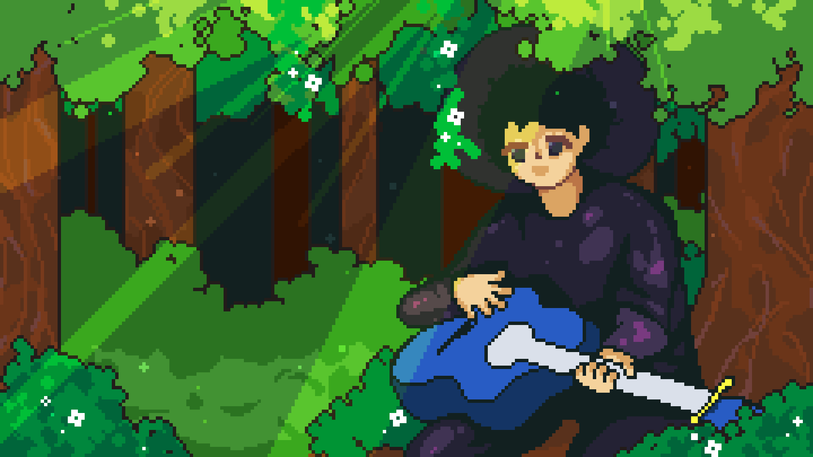

<h1><b>Hi , I am Nicolàs </b></h1>
<!--  -->

I am a student of software development, I am mainly interested in the development of video games and cybersecurity but I do not rule out the creation of other projects :)

    
    
    
    

